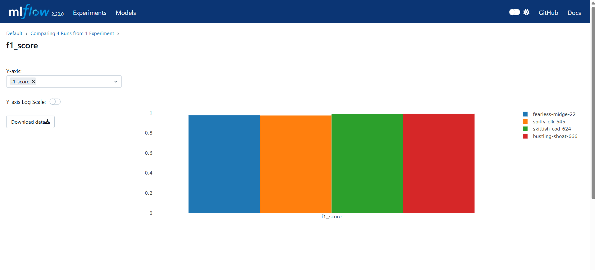
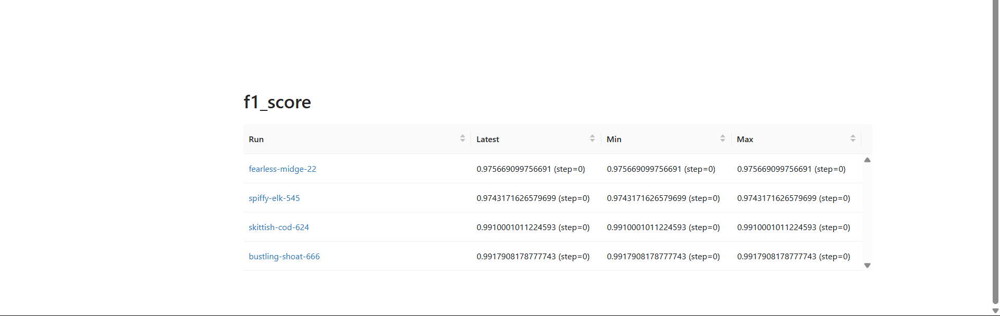
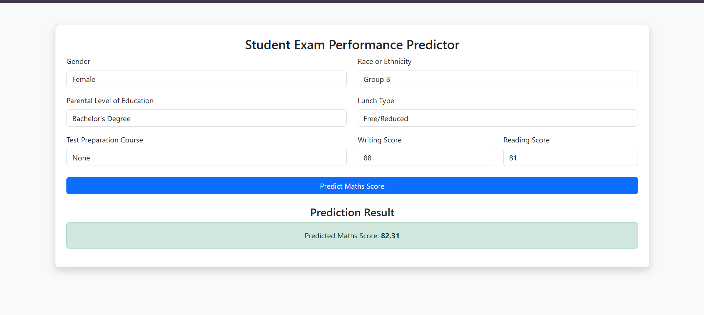

# 🚀 Student Performance Prediction (Machine Learning Project)

## 📌 Objective  
Built an **end-to-end machine learning system** to predict student performance based on **academic and demographic features**, ensuring **data-driven decision-making**. This project is designed to help educators and institutions make informed decisions to enhance student outcomes.

---

## 🌟 Features

✅ **End-to-end ML Pipeline** – Automates data ingestion, preprocessing, training, and deployment.  
✅ **Multiple Machine Learning Models** – Evaluates different models and selects the best one based on performance metrics.  
✅ **Real-time Predictions** – Deploys the trained model using **Flask API** for real-time student performance prediction.  
✅ **Model Tracking & Experimentation** – Uses **MLflow & DagsHub** for logging, tracking, and versioning ML experiments.  
✅ **Cloud Integration** – Stores model artifacts and logs on **AWS S3**.  
✅ **Dockerized Deployment** – Uses **Docker** for scalable and portable model deployment.  

---

## 🔥 Key Contributions  

### ✅ Data Ingestion & Preprocessing  
- Extracted student performance data from **MongoDB** and converted it into CSV format.  
- Handled missing values using **SimpleImputer** for numerical and categorical data.  
- Performed exploratory data analysis (EDA) to understand feature distributions and correlations.  
- Split the dataset into **training and testing sets** for model evaluation.  

### ✅ Data Validation & Transformation  
- Applied **StandardScaler** for numerical features and **OneHotEncoder** for categorical variables.  
- Used **Kolmogorov-Smirnov test** to detect **data drift** between training and testing datasets.  
- Saved transformed data using **NumPy arrays** for optimized processing.  

### ✅ Model Training & Hyperparameter Tuning  
- Implemented multiple regression models:  
  - **Random Forest, Gradient Boosting, XGBoost, AdaBoost, Decision Tree, Linear Regression**.  
- Optimized model performance using **Grid Search & Hyperparameter tuning**.  
- Achieved **high R² score (>0.85)** in predicting student scores.  
- Used **MLflow** for model tracking, experiment logging, and performance evaluation.  

### ✅ Model Tracking & Experimentation  
- Integrated **DagsHub** with **MLflow** for seamless version control, experiment tracking, and collaboration.  
- Logged **model parameters, evaluation metrics, and trained models** in MLflow.  
- Compared different models and stored the **best-performing model** for deployment.  

### ✅ Deployment & Cloud Integration  
- Designed an **automated ML pipeline** for data ingestion, validation, transformation, and model training.  
- Deployed the trained model using **Flask API** to serve predictions.  
- Packaged the model using **Docker** for deployment.  
- Synced trained models and artifacts to **AWS S3** for storage and real-time updates.  

---

## 🚀 How to Run the Project  

### 1️⃣ Clone the Repository  
```bash
git clone https://github.com/your-repo/student-performance-prediction.git
cd student-performance-prediction
```

### 2️⃣ Install Dependencies  
```bash
pip install -r requirements.txt
```

### 3️⃣ Set Up MongoDB Database  
- Ensure MongoDB is installed and running.  
- Update **MongoDB connection string** in `push_data.py`.  

### 4️⃣ Run the Data Pipeline  
```bash
python training_pipeline.py
```

### 5️⃣ Start Flask API  
```bash
python app.py
```
- Open `http://127.0.0.1:5000` in your browser.  
- Upload student data and get performance predictions in real-time!  

### 6️⃣ Deploy with Docker  
```bash
docker build -t student-performance-prediction .
docker run -p 5000:5000 student-performance-prediction
```

---

## 📸 Screenshots  

### 🔹 MLflow Experiment Tracking  
  
  

### 🔹 Student Prediction UI  
  

---

## 🛠️ Tech Stack & Tools  
- **Programming Language:** Python  
- **Libraries:** Pandas, NumPy, Scikit-learn, Matplotlib, Seaborn  
- **Model Tracking:** MLflow, DagsHub  
- **Database:** MongoDB, PyMongo  
- **Deployment:** Flask, Docker, AWS S3  

---
📧 **Contact:** adityasinha@iiitranchi.ac.in  
🚀 **Happy Coding!**

